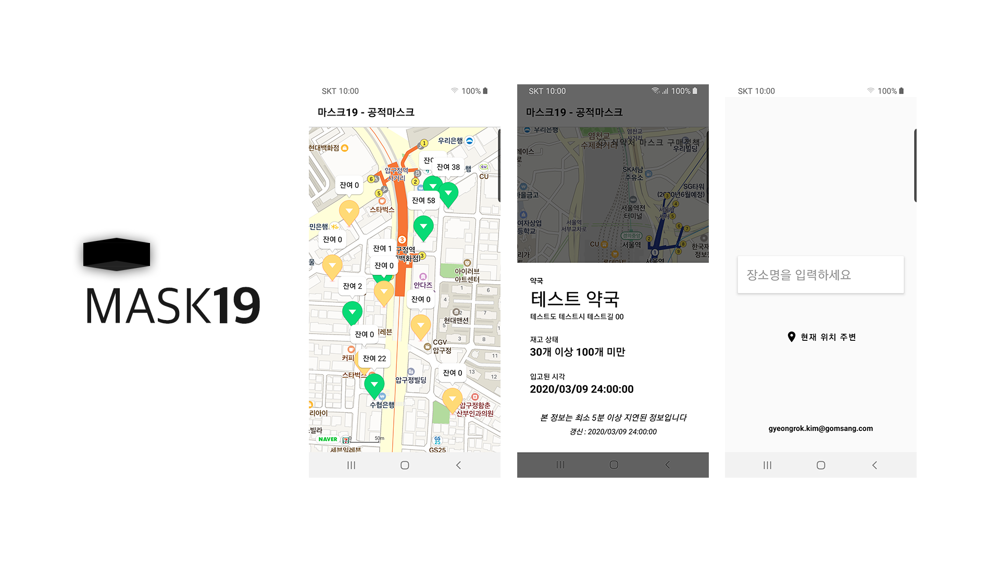

# Mask19Android

This project is an application developed to provide inventory information in accordance with the COVID-19 Mask Public Sales Policy in Republic of Korea.

As the Korean government abolished the public mask sales system from July 12, 2020, the service was terminated. The API does not work now.

This application was installed by a total of 30K+ users during the period of operation of the public mask sales system, with 17 users leaving 17 assessments, and a rating of 4.412.

For data disclosure inquiries, please contact:

maskdata@nia.or.kr

Please understand that the urgently produced Android application does not make the project's own pattern smooth. If you have any questions regarding this project, please send us a Github personal email.
